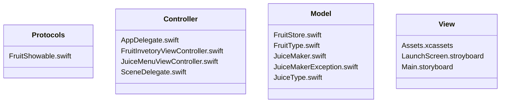
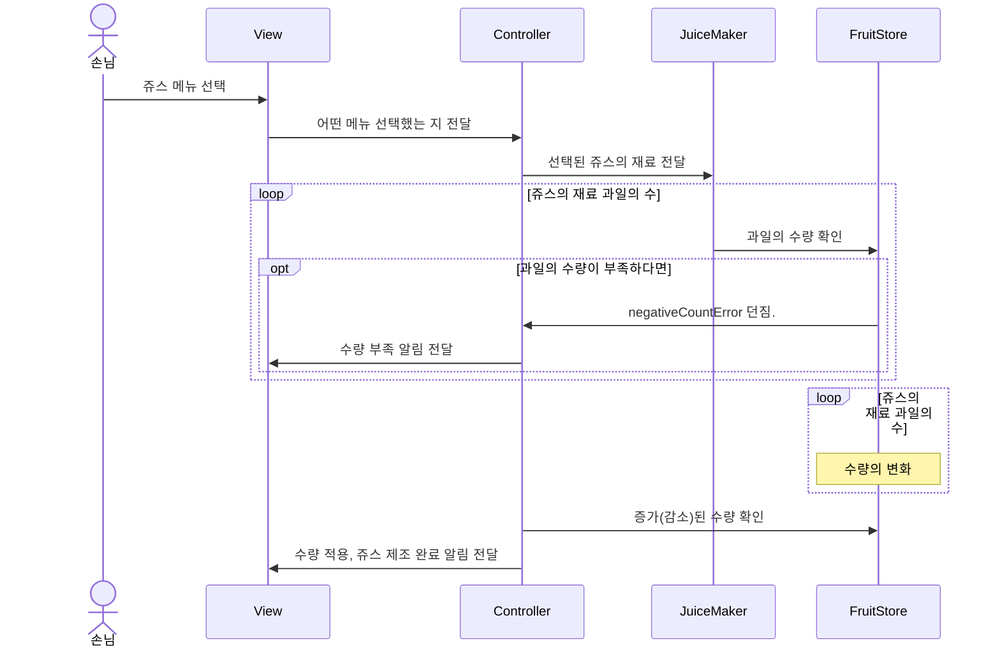
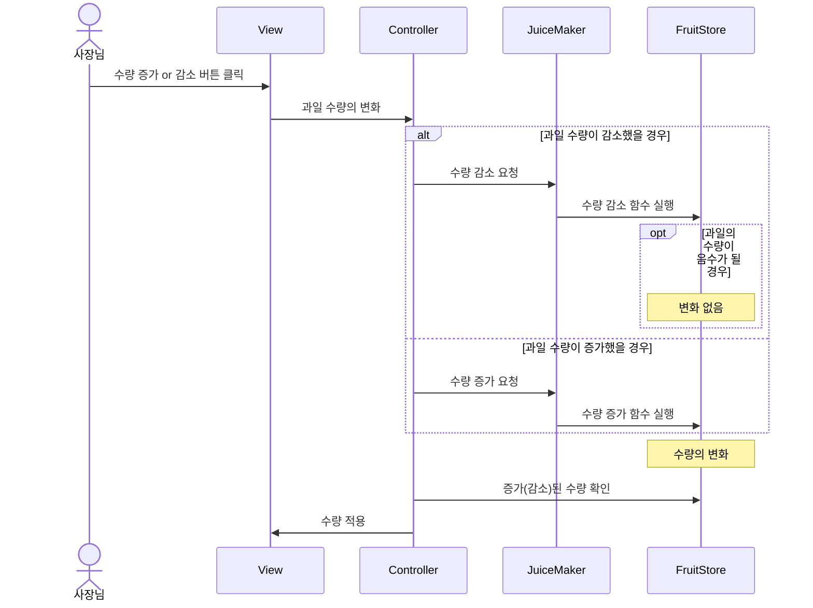

# ios-juice-maker🧃
쥬스메이커 프로젝트 저장소입니다. 

## 목차⚡
- [기간](#기간calendar)
- [팀원](#팀원busts_in_silhouette)
- [실행 화면](#실행-화면desktop_computer)
- [실행 영상](#실행-영상clapper)
- [스토리보드](#스토리보드clipboard)
- [파일 구조](#파일-구조file_folder)
- [파일 설명](#파일-설명bookmark_tabs)
- [흐름도](#흐름도ocean)
- [고민했던점 및 궁금했던점](#고민했던점 및 궁금했던점interrobang)

  

## 기간:calendar:
2023.09.11 ~ 2023.09.27

  

## 팀원:busts_in_silhouette: 
| 프로필 사진 |  |  |
| ---- | ----------- | --------- |
| in Github | [@newJunsung](https://github.com/newJunsung) | [@JJong](https://github.com/shlim0) |
| in SeSAC | 뉴준성 | 쫑 |

[목차로 돌아가기](#목차)
  

## 실행 화면:desktop_computer:	
- 주스 주문 화면

- 주스 주문 성공 화면

- 주스 주문 실패 화면

- 과일 재고 수정 화면

- 과일 재고 수정 (0 ~ 100개)

- 과일 재고 수정 완료 화면

[목차로 돌아가기](#목차)
  

## 실행 영상:clapper:	
https://github.com/newJunsung/ios-juice-maker/assets/46235301/630e7754-8fef-406b-a06c-a5bade4ecbe9

[목차로 돌아가기](#목차)
  

## 스토리보드:clipboard:	

[목차로 돌아가기](#목차)
  

## 파일 구조:file_folder: 

[목차로 돌아가기](#목차)
  

## 파일 설명:bookmark_tabs:	
- JuiceMaker
   - Protocols
      - FruitShowable: 과일 개수의 증감이 일어날 때 View에 반영합니다.
   - Controller
      - FruitInvetoryViewController: 과일 재고 수정을 합니다.
      - JuiceMenuViewController: 쥬스 메뉴의 주문을 처리합니다. 또, 주스 주문 및 과일 재고 수정을 합니다.
   - Model
      - FruitStore: 과일 개수를 조작하는 Class 입니다. 싱글톤 패턴으로 외부에서 접근할 수 있으며, `[FruitType: Int]` 타입으로 과일 개수를 저장합니다.
      - FruitType: 과일 종류를 정의합니다. 또한, `(fruitType: FruitType, count: Int)`을 `Fruit`으로 typealias 합니다.
      - JuiceMaker: FruitStore 인스턴스에 접근 해, 주스 주문 및 과일 재고 수정을 하는 Struct 입니다.
      - JuiceMakerException: 주스 주문시 과일 개수가 없는 경우, 과일 재고가 0보다 작은 경우의 예외를 처리합니다.
      - JuiceType: 쥬스 종류를 정의합니다. 또한, 쥬스 종류에 따라 소모되는 과일과 개수를 정의합니다.
   - View

[목차로 돌아가기](#목차)
  

## 흐름도:ocean:
- **쥬스 선택**

- **과일 수량 증감**  

[목차로 돌아가기](#목차)
  

## 고민했던점 및 궁금했던점:interrobang:	

